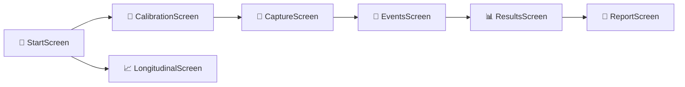
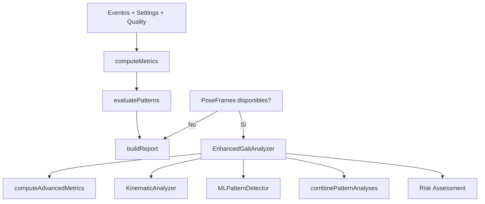
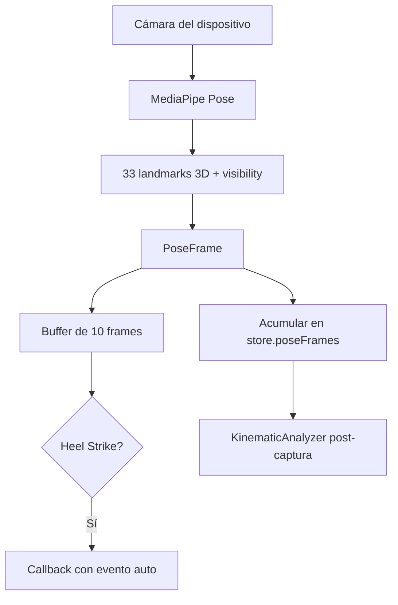

# GAIT MVP — Documentación del Sistema Actual

> **Versión**: 0.1.0 · **Stack**: React 19 + TypeScript + Vite 7 + Zustand 5 + MediaPipe Pose + Supabase + jsPDF  
> **Despliegue**: PWA optimizada para Netlify (service worker via `vite-plugin-pwa`)

---

## 1. Visión General

GaitTest es una **aplicación web progresiva (PWA)** que permite capturar video de la marcha de un paciente desde el navegador móvil, calcular métricas biomecánicas, detectar patrones patológicos y generar reportes clínicos — todo procesado localmente en el dispositivo.



---

## 2. Arquitectura de Carpetas

```
src/
├── App.tsx                    # Router principal (7 rutas)
├── main.tsx                   # Punto de entrada (BrowserRouter)
├── state/
│   └── sessionStore.ts        # Store global Zustand
├── screens/                   # 7 pantallas del flujo
│   ├── StartScreen.tsx
│   ├── CalibrationScreen.tsx
│   ├── CaptureScreen.tsx
│   ├── EventsScreen.tsx
│   ├── ResultsScreen.tsx
│   ├── ReportScreen.tsx
│   └── LongitudinalScreen.tsx
├── components/                # Componentes reutilizables
│   ├── LongitudinalAnalysis.tsx
│   ├── OGSInput.tsx
│   ├── OGSValidationPanel.tsx
│   └── PatientSearch.tsx
├── hooks/                     # Custom hooks
│   ├── useMediaRecorder.ts
│   ├── usePoseEstimation.ts
│   ├── useKinematicAnalysis.ts
│   └── useLongitudinalAnalysis.ts
├── lib/                       # Lógica de negocio (23 módulos)
│   ├── metrics.ts             # Métricas básicas
│   ├── advancedMetrics.ts     # Métricas avanzadas
│   ├── patterns.ts            # Heurísticas clínicas
│   ├── mlPatterns.ts          # Detección ML de patrones
│   ├── enhancedAnalysis.ts    # Orquestador del análisis completo
│   ├── kinematicAnalysis.ts   # Ángulos articulares (37KB)
│   ├── kinematicExtractor.ts  # Extractor para DB
│   ├── poseEstimation.ts      # MediaPipe Pose wrapper
│   ├── ogsAnalysis.ts         # Escala OGS
│   ├── clinicalValidation.ts  # Correlaciones OGS-instrumental
│   ├── compensationDetection.ts # Patrones de compensación
│   ├── pathologyAnalysis.ts   # Análisis de patologías
│   ├── gaitCycleAnalysis.ts   # Ciclos de marcha
│   ├── frontalAnalysis.ts     # Análisis del plano frontal
│   ├── advancedEventDetection.ts # Detección avanzada de eventos
│   ├── medicalReporting.ts    # Generador de reportes (40KB)
│   ├── longitudinalAnalysis.ts # Análisis temporal
│   ├── pdf.ts                 # Exportación PDF (jsPDF)
│   ├── report.ts              # Builder de ReportSummary
│   ├── quality.ts             # Evaluación de calidad
│   ├── format.ts              # Utilidades de formato
│   ├── sessionSchema.ts       # Schema Zod
│   └── supabase.ts            # Cliente Supabase + tipos DB
├── services/
│   └── dataService.ts         # CRUD Supabase + CSV export
├── types/
│   └── session.ts             # ~430 líneas de interfaces TypeScript
└── data/                      # (vacío — datos vienen de Supabase)
```

---

## 3. Flujo Principal del Usuario

### 3.1 StartScreen (`/`)

- Resetea la sesión anterior (`resetSession()`)
- El usuario selecciona **vista de captura**: lateral (recomendada), frontal, o dual (no disponible aún)
- Muestra checklist de preparación (distancia, iluminación, posición del móvil)
- Requiere **consentimiento explícito** antes de continuar
- Botón secundario: acceso directo al **análisis longitudinal**

### 3.2 CalibrationScreen (`/calibration`)

- Permite al usuario definir la **distancia de referencia** (default: 5 metros)
- Tipo de calibración: línea en el suelo (`line`) u objeto de referencia (`object`)
- Establece `captureSettings.distanceMeters` en el store

### 3.3 CaptureScreen (`/capture`)

- Activa la cámara del dispositivo vía `useMediaRecorder` hook
- Graba video usando la API `MediaRecorder` del navegador
- **Pose Estimation en tiempo real** con MediaPipe Pose:
  - Detecta 33 landmarks corporales por frame
  - Extrae landmarks clave: tobillos, rodillas, caderas, talones, hombros
  - Detecta automáticamente **heel strikes** (contacto de talón) comparando velocidad vertical del tobillo
- Almacena `PoseFrame[]` en el store y el `videoBlob`
- Monitorea calidad: FPS, duración, iluminación

### 3.4 EventsScreen (`/events`)

- Visualiza el video capturado con controles de reproducción
- Permite **anotación manual** de eventos (heel strikes L/R) sobre la timeline
- Combina eventos automáticos (pose estimation) con manuales
- Soporta 6 tipos de evento: `heel_strike`, `toe_off`, `foot_flat`, `heel_off`, `max_knee_flexion`, `max_hip_extension`
- **Checklist observacional** con 7 ítems clínicos:
  - Inclinación lateral del tronco, circunducción, contacto con antepié, paso corto, cadencia alta, base amplia, timing irregular

### 3.5 ResultsScreen (`/results`)

- Llama a `finalizeAnalysis()` que ejecuta el pipeline completo:



- Muestra métricas: velocidad, cadencia, longitud de paso, asimetría
- Semáforo de riesgo: 🟢 verde / 🟡 amarillo / 🔴 rojo
- Panel de patrones detectados con niveles de confianza
- Componente **OGSInput**: evaluación manual de 8 fases del ciclo de marcha por pierna (escala -1 a 3)
- Componente **OGSValidationPanel**: correlaciones OGS vs datos instrumentales

### 3.6 ReportScreen (`/report`)

- Genera reporte clínico completo usando `medicalReporting.ts` (40KB de lógica)
- Exportación a **PDF** vía jsPDF
- Exportación a **JSON** estructurado (schema Zod)
- Opción de **guardar en Supabase** (`saveSessionToDatabase()`)

### 3.7 LongitudinalScreen (`/longitudinal`)

- Componente `PatientSearch` con autocompletado contra Supabase
- Componente `LongitudinalAnalysis` que muestra:
  - Historial de sesiones del paciente
  - Tendencias temporales (velocidad, cadencia, OGS)
  - Cálculo de mejoras/deterioros porcentuales
  - Exportación CSV para investigación

---

## 4. Motor de Análisis

### 4.1 Métricas Básicas (`metrics.ts`)

| Métrica | Cálculo |
|---|---|
| Velocidad (m/s) | `distancia / duración` |
| Cadencia (pasos/min) | `(nPasos / duración) × 60` |
| Longitud de paso (m) | `velocidad × tiempo_inter_paso` |
| Asimetría de apoyo (%) | `|stanceL - stanceR| / promedio × 100` |
| Stance time L/R | Del heel_strike al siguiente heel_strike contralateral |

### 4.2 Métricas Avanzadas (`advancedMetrics.ts`)

Extiende `SessionMetrics` con:
- **Variabilidad temporal**: CV de intervalos entre pasos, doble apoyo
- **Espaciales**: ancho de base, ángulo del pie
- **Fases**: % swing, % stance
- **Estabilidad**: harmonic ratio, variabilidad de aceleración, centro de masa
- **Articulares**: ángulos promedio de rodilla y cadera (L/R)

### 4.3 Cinemática (`kinematicAnalysis.ts` — 37KB)

El módulo más extenso. Procesa `PoseFrame[]` para calcular:
- Series temporales de ángulos articulares (tobillo, rodilla, cadera, pelvis, tronco)
- En planos **sagital** y **frontal**
- ROM (rango de movimiento) por articulación y lado
- Valores pico y su timing en el ciclo
- Desviaciones respecto a rangos normativos
- Score de calidad cinemática

Estructura de datos:

```typescript
KinematicData {
  sagittal: {
    hipFlexion, kneeFlexion, ankleFlexion,
    pelvisTilt, trunkFlexion
  }
  frontal: {
    hipAbduction, kneeAbduction, ankleInversion,
    pelvisObliquity, trunkLateralFlexion
  }
}
```

### 4.4 Detección de Patrones

**Heurísticas clínicas** (`patterns.ts`) — evalúa 5 patrones:

| Patrón | Criterios |
|---|---|
| **Antálgica** | Asimetría apoyo ≥15% → likely, ≥10% → possible |
| **Trendelenburg** | Requiere vista frontal + inclinación lateral |
| **Estepaje** | Contacto antepié + circunducción |
| **Parkinsoniana** | Paso <0.5m + cadencia >110 spm |
| **Atáxica** | Base amplia + timing irregular |

**Machine Learning** (`mlPatterns.ts`) — clasificación probabilística con TensorFlow.js:
- Clasifica patrones de marcha desde métricas avanzadas
- Detección de anomalías estadísticas
- Evaluación de riesgo de caídas (0-100%)
- Los resultados ML se **combinan** con heurísticas tradicionales

### 4.5 Análisis Clínico Adicional

- **OGS** (`ogsAnalysis.ts`): Escala Observacional de Marcha con 8 fases × 2 piernas, scores -1 a 3
- **Compensaciones** (`compensationDetection.ts`): Detección de patrones compensatorios
- **Patología** (`pathologyAnalysis.ts`): Análisis patológico con findings, severity, recommendations
- **Ciclos de marcha** (`gaitCycleAnalysis.ts`): Segmentación en ciclos completos
- **Análisis frontal** (`frontalAnalysis.ts`): Específico para vista frontal/coronal
- **Validación clínica** (`clinicalValidation.ts`): Correlaciones OGS vs datos instrumentales

---

## 5. Estado Global (Zustand)

El store `sessionStore.ts` gestiona un único objeto `SessionData` con:

```
SessionData
├── sessionId (UUID)
├── createdAtIso
├── captureSettings: { viewMode, calibrationType, distanceMeters, targetFps }
├── quality: { fpsDetected, lightingScore, issues[], confidence, duration }
├── events: GaitEvent[]
├── observations: ObservationChecklist (7 booleans)
├── metrics: SessionMetrics
├── patternFlags: PatternFlag[]
├── report: { trafficLight, notes, pdfUrl }
├── ogs: OGSAnalysis | null
├── patient?: { name, identifier, age, height, weight, clinicianNote }
├── videoBlob?: Blob
├── poseFrames?: PoseFrame[]
├── advancedMetrics?: AdvancedMetrics
├── enhancedAnalysisResult?: { pathologyAnalysis, kinematicSummary, kinematicValues }
└── kinematics?: { summary, detailed, report }
```

**Acciones principales:**
- `resetSession()` — nueva sesión limpia
- `addHeelStrike(foot, timestamp, source)` — agrega evento de talón
- `setOGSScore(left, right)` — calcula análisis OGS completo
- `finalizeAnalysis()` — pipeline completo (básico + enhanced si hay poses)
- `saveSessionToDatabase()` — persiste en Supabase

---

## 6. Persistencia (Supabase)

### 6.1 Tablas

| Tabla | Propósito |
|---|---|
| `session_records` | Sesión completa como JSONB + métricas desnormalizadas para queries rápidos |
| `gait_analysis_records` | Un registro por lado (L/R) con datos cinemáticos individuales en formato CSV-compatible |

### 6.2 Índices
- `patient_id` en ambas tablas
- `session_date` y `created_at` para queries temporales
- `exam_id` para identificación única

### 6.3 DataService

| Método | Descripción |
|---|---|
| `initializeDatabase()` | Crea tablas si no existen (via `rpc('exec_sql')`) |
| `saveSession(data)` | Inserta en `session_records` + genera registros en `gait_analysis_records` |
| `getPatientSessions(id)` | Lista sesiones de un paciente |
| `getLongitudinalAnalysis(id)` | Sesiones + gait records + tendencias calculadas |
| `exportPatientDataToCSV(id)` | Genera string CSV con headers de investigación |
| `searchPatients(query)` | Búsqueda fuzzy por `patient_id` o `patient_name` |

---

## 7. Pose Estimation (MediaPipe)



**Detección de heel strike** basada en:
1. Velocidad vertical del tobillo ≈ 0 (detenido)
2. Tobillo por debajo de la rodilla
3. Visibilidad del landmark > 0.7

---

## 8. Build y Despliegue

- **Dev**: `npm run dev` (Vite dev server)
- **Build**: `tsc -b && vite build` → genera `dist/`
- **PWA**: Service worker automático, manifest con iconos 192/512, tema dark (#0f172a)
- **Chunking manual**: separa React, Supabase, MediaPipe y TensorFlow en chunks independientes
- **Workbox**: cache de hasta 5MB por archivo

### Variables de entorno
```
VITE_SUPABASE_URL=<url del proyecto>
VITE_SUPABASE_ANON_KEY=<anon key>
```

---

## 9. Dependencias Clave

| Paquete | Versión | Uso |
|---|---|---|
| `react` | 19.1 | UI framework |
| `react-router-dom` | 7.9 | Routing SPA |
| `zustand` | 5.0 | Estado global |
| `@mediapipe/pose` | 0.5 | Estimación de poses |
| `@tensorflow/tfjs` | 4.22 | ML para patrones |
| `@supabase/supabase-js` | 2.57 | Base de datos cloud |
| `jspdf` | 3.0 | Exportación PDF |
| `zod` | 4.1 | Validación de schemas |
| `vite-plugin-pwa` | 1.0 | PWA (service worker) |

---

## 10. Limitaciones Conocidas

1. **Cinemática parcial**: Los ángulos articulares se calculan pero algunos campos CSV de investigación pueden quedar vacíos
2. **Calibración manual**: La precisión de métricas depende de la distancia ingresada por el usuario
3. **Solo hilo principal**: El procesamiento de video no usa Web Workers
4. **Sin autenticación**: No hay sistema de login/roles — acceso abierto a Supabase via anon key
5. **Análisis dual no disponible**: La opción de captura dual (lateral + frontal) está deshabilitada
6. **Tests limitados**: Vitest configurado pero cobertura ~20%
7. **Sin RLS**: Las tablas de Supabase no tienen Row Level Security configurada
