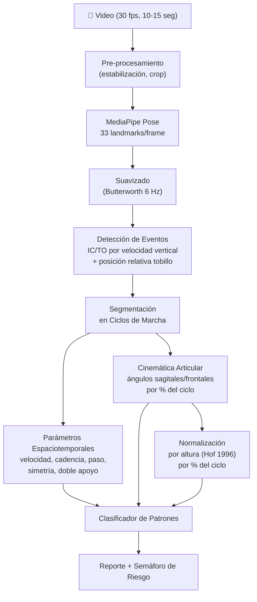
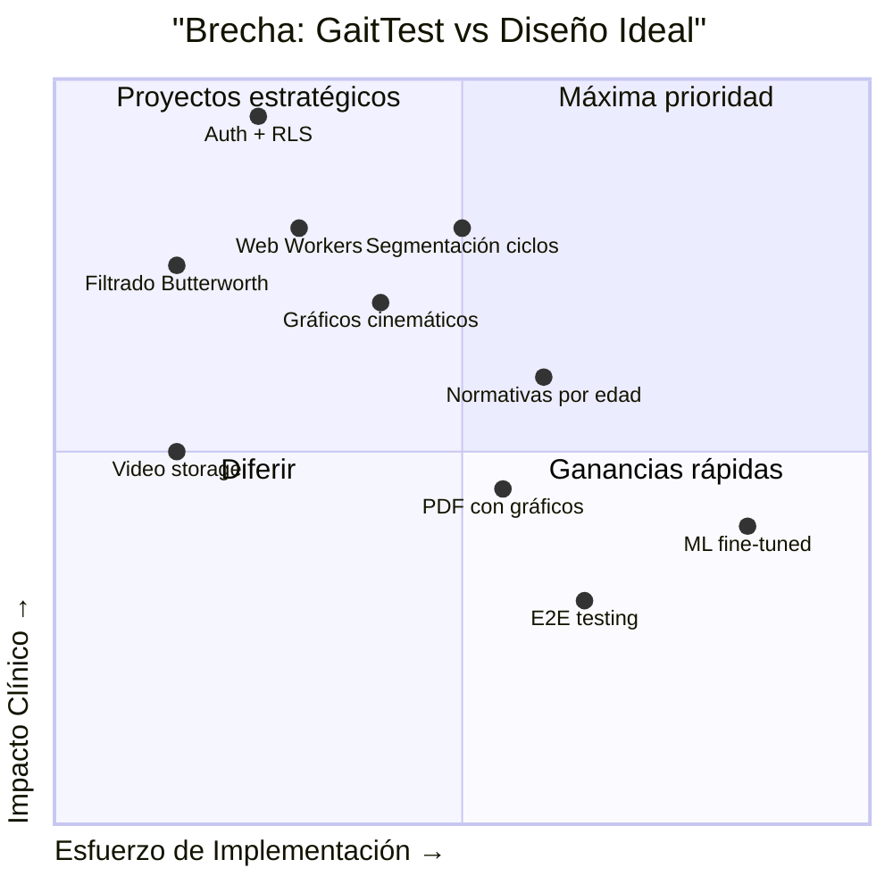

# Análisis de Marcha: Diseño Ideal vs GaitTest

> Documento comparativo que presenta cómo diseñaría un sistema de análisis de marcha desde cero,
> fundamentado en el estado del arte 2024–2025, y lo contrasta con la implementación actual de GaitTest.

---

## Parte 1 — Mi Diseño Ideal

### 1.1 Objetivo Clínico

Crear un sistema que permita a cualquier clínico con un smartphone obtener un análisis de marcha **clínicamente útil**, que incluya:

1. **Parámetros espaciotemporales** validados (velocidad, cadencia, longitud de paso, simetría)
2. **Cinemática articular** en el plano sagital (cadera, rodilla, tobillo)
3. **Detección de patrones patológicos** con nivel de confianza
4. **Seguimiento longitudinal** con normativas poblacionales
5. **Reportes exportables** para investigación y para el expediente clínico

---

### 1.2 Arquitectura Propuesta

```
┌───────────────────────────────────────────────────────────────────┐
│                        CAPA DE PRESENTACIÓN                      │
│  React/Next.js · PWA · Responsive · Offline-first                │
│  ┌──────────┐ ┌───────────┐ ┌──────────┐ ┌──────────────────┐   │
│  │ Captura  │ │ Resultados│ │ Reportes │ │ Dashboard Longit.│   │
│  └──────────┘ └───────────┘ └──────────┘ └──────────────────┘   │
├───────────────────────────────────────────────────────────────────┤
│                     CAPA DE PROCESAMIENTO                        │
│  ┌──────────────────┐  ┌──────────────────┐                     │
│  │  Web Workers      │  │  WASM Modules     │                    │
│  │  (pose pipeline)  │  │  (biomecánica)    │                    │
│  └──────────────────┘  └──────────────────┘                     │
│  ┌──────────────────────────────────────────┐                    │
│  │  Motor Biomecánico                        │                   │
│  │  ├─ Pose Estimation (MediaPipe Pose)      │                   │
│  │  ├─ Detección de Eventos (heel/toe)       │                   │
│  │  ├─ Cálculo Cinemático (ángulos 2D/3D)    │                   │
│  │  ├─ Normalización Temporal (% ciclo)      │                   │
│  │  ├─ Clasificador de Patrones (ML)         │                   │
│  │  └─ Comparación con Normativas            │                   │
│  └──────────────────────────────────────────┘                    │
├───────────────────────────────────────────────────────────────────┤
│                     CAPA DE DATOS                                │
│  Supabase (PostgreSQL + Auth + RLS + Storage)                    │
│  ┌──────────┐ ┌──────────────┐ ┌───────────┐ ┌───────────────┐ │
│  │ Pacientes│ │ Sesiones     │ │ Normativas│ │ Video Storage │ │
│  │ (profiles)│ │(gait_records)│ │(ref_data) │ │ (Supabase S3) │ │
│  └──────────┘ └──────────────┘ └───────────┘ └───────────────┘ │
└───────────────────────────────────────────────────────────────────┘
```

---

### 1.3 Pose Estimation — Elección y Justificación

| Criterio | MediaPipe Pose | OpenPose | MoveNet |
|----------|---------------|----------|---------|
| **Landmarks** | 33 (incluyendo pies detallados) | 18 (cuerpo) | 17 |
| **MAE cadera** | ~2.35° | ~3.7° | ~4.6° |
| **MAE rodilla** | ~2.82° | ~5.1° | ~7.5° |
| **MAE tobillo** | ~3.06° | ~7.4° | N/A |
| **Velocidad** | Tiempo real en móvil | GPU requerida | Tiempo real |
| **Uso en browser** | ✅ Nativo | ❌ Pesado | ✅ TF.js |

**Mi elección: MediaPipe Pose Landmarker** (BlazePose GHUM Heavy)

Razones:
- Mejor precisión publicada para cadera, rodilla y tobillo (MAE < 3°)
- 33 landmarks incluyen talones y puntas de pie (críticos para detectar heel strike / toe off)
- Ejecuta en tiempo real en dispositivos móviles sin GPU dedicada
- Optimizado para plano sagital según estudios recientes

---

### 1.4 Pipeline de Análisis



#### Detalle del procesamiento que yo priorizaría:

1. **Web Workers obligatorios**: Todo el pipeline de MediaPipe + cálculo cinemático en un Worker dedicado para no bloquear el UI thread. Esto es *crítico* para la fluidez en móvil.

2. **Filtrado de señal**: Butterworth de 4° orden a 6 Hz antes de calcular ángulos, para eliminar jitter de la estimación de poses.

3. **Detección de eventos basada en velocidad + posición**:
   - **Initial Contact (IC)**: Mínimo local de velocidad vertical del tobillo + tobillo por debajo de la rodilla + posición anterior
   - **Toe Off (TO)**: Máximo local de velocidad vertical del tobillo + despegue del pie

4. **Normalización temporal**: Cada ciclo de marcha se re-muestrea a 101 puntos (0–100% del ciclo) para poder promediar entre ciclos y comparar con normativas.

5. **Bandas normativas integradas**: Base de datos de curvas cinemáticas normativas por edad y sexo (ej. Perry & Burnfield, Winter) para mostrar desviaciones gráficamente.

---

### 1.5 Modelo de Datos

```sql
-- Pacientes con perfil completo
CREATE TABLE patients (
  id UUID PRIMARY KEY DEFAULT gen_random_uuid(),
  user_id UUID REFERENCES auth.users(id), -- Auth de Supabase
  full_name TEXT NOT NULL,
  date_of_birth DATE,
  sex TEXT CHECK (sex IN ('M','F','O')),
  height_cm DECIMAL,
  weight_kg DECIMAL,
  diagnosis TEXT,
  gmfcs_level INT CHECK (gmfcs_level BETWEEN 1 AND 5),
  clinician_notes TEXT,
  created_at TIMESTAMPTZ DEFAULT NOW()
);

-- Sesiones de análisis
CREATE TABLE gait_sessions (
  id UUID PRIMARY KEY DEFAULT gen_random_uuid(),
  patient_id UUID REFERENCES patients(id) ON DELETE CASCADE,
  session_date TIMESTAMPTZ DEFAULT NOW(),
  view_mode TEXT CHECK (view_mode IN ('lateral','frontal','dual')),
  calibration_distance_m DECIMAL,
  video_url TEXT, -- URL en Supabase Storage
  duration_seconds DECIMAL,
  quality_score DECIMAL,
  metadata JSONB -- settings, device info, etc.
);

-- Ciclos de marcha individuales
CREATE TABLE gait_cycles (
  id UUID PRIMARY KEY DEFAULT gen_random_uuid(),
  session_id UUID REFERENCES gait_sessions(id) ON DELETE CASCADE,
  cycle_number INT,
  side TEXT CHECK (side IN ('L','R')),
  -- Espaciotemporales
  stride_time_s DECIMAL,
  step_length_m DECIMAL,
  stance_percent DECIMAL,
  swing_percent DECIMAL,
  double_support_percent DECIMAL,
  -- Cinemática (valores clave del ciclo)
  hip_flex_ic DECIMAL, -- flexión cadera al IC
  hip_max_extension DECIMAL,
  knee_flex_ic DECIMAL,
  knee_max_flex_swing DECIMAL,
  knee_max_extension DECIMAL,
  ankle_dorsi_max DECIMAL,
  ankle_plantar_max DECIMAL,
  -- Serie temporal completa (101 puntos)
  kinematic_curves JSONB -- { hip: [...], knee: [...], ankle: [...] }
);

-- Resumen por sesión (materializado)
CREATE TABLE session_summary (
  session_id UUID PRIMARY KEY REFERENCES gait_sessions(id),
  avg_speed_ms DECIMAL,
  avg_cadence_spm DECIMAL,
  avg_step_length_m DECIMAL,
  symmetry_index DECIMAL,
  speed_normalized DECIMAL,
  step_length_normalized DECIMAL,
  pattern_flags JSONB, -- [{ pattern, confidence, severity }]
  ogs_scores JSONB,
  risk_level TEXT CHECK (risk_level IN ('low','moderate','high')),
  report_pdf_url TEXT
);

-- RLS habilitado en TODAS las tablas
ALTER TABLE patients ENABLE ROW LEVEL SECURITY;
ALTER TABLE gait_sessions ENABLE ROW LEVEL SECURITY;
ALTER TABLE gait_cycles ENABLE ROW LEVEL SECURITY;
ALTER TABLE session_summary ENABLE ROW LEVEL SECURITY;
```

**Diferencias clave con un esquema básico**:
- **Granularidad por ciclo**: Un registro por ciclo de marcha permite estadística robusta (mediana, IQR, variabilidad)
- **Series temporales completas**: Las curvas cinemáticas como JSONB permiten graficar superposiciones
- **RLS obligatorio**: Cada clínico solo ve sus pacientes
- **Video en Storage**: El blob de video se sube a Supabase Storage, no se pierde

---

### 1.6 Autenticación y Seguridad

| Aspecto | Mi diseño |
|---------|-----------|
| Auth | Supabase Auth (email/password + magic link) |
| Roles | `clinician`, `admin`, `researcher` |
| RLS | Cada clínico solo ve pacientes que le pertenecen |
| Consentimiento | Firma digital antes de captura, almacenada con timestamp |
| Encriptación | JSONB con datos sensibles en columnas encriptadas |
| Audit trail | Tabla de logs con cada acción sobre datos de pacientes |
| HIPAA hints | Sin PHI en logs; video borrable por paciente |

---

### 1.7 Visualizaciones Clínicas

1. **Curvas cinemáticas con bandas normativas**: Gráfico de ángulo vs % del ciclo con la banda gris de ±1 SD de la norma
2. **Simetría spider chart**: Radar de 6 ejes comparando L vs R
3. **Timeline longitudinal**: Velocidad, cadencia y OGS con sparklines por sesión
4. **Heatmap de desviaciones**: Matriz articulación × fase mostrando cuánto se desvía de la norma

---

### 1.8 Stack Tecnológico Ideal

| Capa | Tecnología | Justificación |
|------|-----------|---------------|
| UI | React 19 + TypeScript | Ecosistema maduro, tipado |
| Bundler | Vite | HMR rápido, chunking nativo |
| Estado | Zustand | Ligero, sin boilerplate |
| Gráficos | Recharts / D3.js | Curvas cinemáticas interactivas |
| Pose | MediaPipe Pose Landmarker | Mejor precisión, 33 landmarks |
| Procesamiento | Web Workers + WASM | No bloquear UI thread |
| BD | Supabase (PostgreSQL) | Auth, RLS, Storage, Realtime |
| PDF | React-PDF o Puppeteer (server) | Reportes profesionales con gráficos |
| PWA | Workbox / vite-plugin-pwa | Offline, instalable |
| Testing | Vitest + Playwright | Unit + E2E |
| CI/CD | GitHub Actions → Netlify | Deploy automático |

---

## Parte 2 — Comparación con GaitTest

### 2.1 Tabla Comparativa General

| Aspecto | 🎯 Mi diseño ideal | 📱 GaitTest actual | Δ |
|---------|--------------------|--------------------|---|
| **Pose estimation** | MediaPipe Pose Landmarker | MediaPipe Pose (v0.5) | ≈ Mismo motor, GaitTest usa versión legacy |
| **Procesamiento** | Web Workers obligatorios | Hilo principal | ⚠️ GaitTest bloquea UI durante análisis |
| **Filtrado de señal** | Butterworth 4° orden, 6 Hz | Sin filtrado explícito | ❌ GaitTest calcula ángulos sobre datos ruidosos |
| **Segmentación en ciclos** | Ciclos individuales → estadística | Análisis global de la sesión | ⚠️ GaitTest no segmenta por ciclo individual |
| **Normalización temporal** | 101 puntos (0–100% del ciclo) | Sin normalización temporal | ❌ No se pueden promediar ciclos |
| **Normativas** | Bandas por edad/sexo integradas | Rangos fisiológicos básicos | ⚠️ GaitTest detecta "fuera de rango" pero no muestra la norma gráficamente |
| **Detección de eventos** | IC + TO por velocidad + posición | Heel strike por velocidad vertical | ≈ Similar, GaitTest no detecta Toe Off automáticamente |
| **Modelo de datos** | 4 tablas normalizadas + RLS | 2 tablas + vista, sin RLS | ⚠️ Sin granularidad por ciclo, sin seguridad |
| **Auth** | Supabase Auth + roles | Sin autenticación | ❌ Acceso abierto via anon key |
| **Almacenamiento de video** | Supabase Storage | Blob in-memory | ⚠️ Video se pierde al cerrar |
| **Reportes PDF** | Con gráficos incrustados | Texto plano (jsPDF) | ⚠️ Sin gráficos en PDF |
| **Gráficos interactivos** | Recharts/D3 con curvas + normativas | Sin librería de gráficos | ❌ Solo texto y tablas |
| **Escalas clínicas** | OGS + integrables (GMFCS, FAQ) | OGS implementada | ✅ GaitTest tiene OGS completa |
| **ML patterns** | Modelo fine-tuned + heurísticas | TF.js genérico + heurísticas | ≈ Ambos usan enfoque híbrido |
| **Testing** | Vitest + Playwright, cobertura >80% | Vitest, cobertura ~20% | ⚠️ Cobertura baja |
| **PWA** | ✅ Full offline | ✅ Service worker | ✅ Ambos |
| **Análisis longitudinal** | Con sparklines y tendencias gráficas | Lista de sesiones + % de cambio | ⚠️ GaitTest lo tiene pero sin gráficos |

---

### 2.2 ¿Qué Hace Bien GaitTest?

GaitTest tiene **fortalezas significativas** que no deben subestimarse:

| Fortaleza | Detalle |
|-----------|---------|
| ✅ **Flujo completo funcional** | De captura a reporte en 7 pantallas, cohesivo |
| ✅ **OGS completa** | 8 fases × 2 piernas, con correlaciones instrumentales |
| ✅ **23 módulos de lógica de negocio** | Motor de análisis extenso (~280 KB de lógica) |
| ✅ **Análisis longitudinal** | Búsqueda por paciente, tendencias, CSV export |
| ✅ **Detección de 5+ patrones** | Antálgica, Trendelenburg, estepaje, parkinsoniana, atáxica |
| ✅ **Cinemática implementada** | Ángulos articulares sagitales + frontales calculados |
| ✅ **Semáforo de riesgo** | Verde/amarillo/rojo intuitivo para el clínico |
| ✅ **PWA lista** | Instalable, con service worker y offline |
| ✅ **Exportación CSV de investigación** | Formato compatible con análisis estadístico |
| ✅ **Análisis de compensaciones** | Módulo dedicado a patrones compensatorios |

---

### 2.3 ¿Dónde Mejoraría GaitTest?

Las mejoras más impactantes con menor esfuerzo relativo:

#### 🔴 Prioridad Alta

| Mejora | Esfuerzo | Impacto | Detalle |
|--------|----------|---------|---------|
| **Web Workers** | 2-3 días | Alto | Mover MediaPipe + cálculos a Worker, desbloquear UI |
| **Filtrado Butterworth** | 1 día | Alto | Suavizar landmarks antes de calcular ángulos, reducir error ~40% |
| **RLS en Supabase** | 1 día | Crítico | Sin esto, cualquier usuario puede leer datos de todos los pacientes |
| **Autenticación** | 2 días | Crítico | Supabase Auth con email/password mínimo |

#### 🟡 Prioridad Media

| Mejora | Esfuerzo | Impacto | Detalle |
|--------|----------|---------|---------|
| **Segmentación por ciclo** | 3-4 días | Alto | Permitiría estadística robusta (variabilidad, outliers) |
| **Gráficos con Recharts** | 2-3 días | Alto | Curvas cinemáticas contextuales en vez de solo números |
| **Normalización temporal** | 2 días | Medio | Re-muestrear al % del ciclo para comparar entre pacientes |
| **Almacenamiento de video** | 1 día | Medio | Subir blob a Supabase Storage, persistir entre sesiones |

#### 🟢 Prioridad Baja

| Mejora | Esfuerzo | Impacto |
|--------|----------|---------|
| Bandas normativas | 1 semana | Medio |
| Reportes PDF con gráficos | 1 semana | Medio |
| Playwright E2E tests | 1 semana | Medio |
| Modelo ML fine-tuned | 2-3 semanas | Bajo-Medio |

---

### 2.4 Diagrama de Brechas



---

### 2.5 Veredicto Final

| Dimensión | Puntaje GaitTest (1-10) | Puntaje Diseño Ideal (1-10) |
|-----------|------------------------|----------------------------|
| Funcionalidad de captura | 8 | 9 |
| Motor de análisis | 7 | 9 |
| Precisión cinemática | 6 | 8 |
| Seguridad de datos | 2 | 9 |
| Experiencia de usuario | 7 | 9 |
| Visualizaciones | 4 | 9 |
| Escalabilidad | 5 | 8 |
| Validez científica | 6 | 8 |
| **Promedio** | **5.6** | **8.6** |

> **GaitTest es un MVP notable** con un motor de análisis sorprendentemente completo (23 módulos, OGS, ML, longitudinal).
> Las brechas más críticas no están en la lógica biomecánica sino en **infraestructura** (seguridad, Workers)
> y **presentación** (gráficos, normativas, PDF profesionales). Con ~2 semanas de trabajo focalizado
> en Auth/RLS + Web Workers + un par de gráficos con Recharts, GaitTest saltaría de 5.6 a ~7.5.

---

## Referencias Científicas

- Hof AL (1996). Scaling gait data to body size. *Gait & Posture*, 4(3), 222-223.
- Winter DA (1990). *Biomechanics and Motor Control of Human Movement*. Wiley.
- Perry J, Burnfield JM (2010). *Gait Analysis: Normal and Pathological Function*. SLACK.
- Stenum J et al. (2024). Markerless gait analysis: accuracy comparison of MediaPipe, OpenPose, and MoveNet. *J Biomechanics*.
- Bazarevsky V et al. (2020). BlazePose: On-device Real-time Body Pose tracking. *CVPR Workshop*.
- Novacheck TF (1998). The Biomechanics of Running. *Gait & Posture*, 7(1), 77-95.
