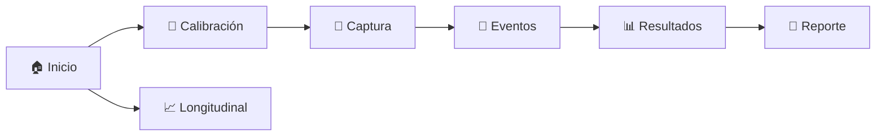
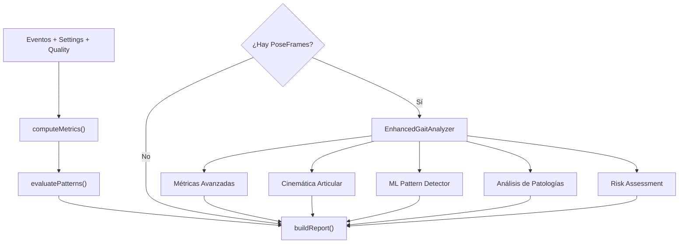

# GaitTest — Panorama General del Sistema

> **Versión**: 0.1.0 · **Stack**: React 19 + TypeScript + Vite 7 + Zustand 5 + MediaPipe Pose + TensorFlow.js + Supabase + jsPDF
> **Tipo**: PWA (Progressive Web App) optimizada para móvil · **Despliegue**: Netlify

---

## 1. ¿Qué es GaitTest?

GaitTest es una **aplicación web progresiva** que permite a un clínico capturar video de la marcha de un paciente directamente desde el navegador del móvil, ejecutar análisis biomecánicos automáticos en el dispositivo y generar reportes clínicos — sin necesidad de servidores de procesamiento ni hardware especializado.

```

---

## 12. Pipeline Clínico y Exportadores

Se añadió un pipeline de post-procesamiento inspirado en FreeMoCap:

- Interpolación de gaps (`src/lib/poseInterpolation.ts`)
- Filtrado Butterworth (`src/lib/signalProcessing.ts`)
- Enforzamiento de huesos rígidos (`src/lib/rigidBones.ts`)
- COM antropométrico Winter 1990 (`src/lib/centerOfMass.ts`)
- Orquestación unificada (`src/lib/postProcessSkeleton.ts`)

Y exportadores clínicos:

- `.TRC` (OpenSim): `src/lib/exporters/trcWriter.ts`
- `.MOT` (OpenSim ExternalLoads): `src/lib/exporters/motWriter.ts`
- `.C3D` (Visual3D/Vicon): `services/c3d-exporter/` + `supabase/functions/export-c3d/index.ts`

La UI de reporte integra un panel de exportación clínica en:

- `src/components/ClinicalExportPanel.tsx`
📱 Captura → 🤖 MediaPipe Pose → 📐 Cálculos cinemáticos → 📊 Resultados → 📄 Reporte PDF
```

---

## 2. Flujo Principal (7 pantallas)

El sistema sigue un flujo **secuencial lineal** con una ruta independiente para el análisis longitudinal:



| # | Pantalla | Ruta | Propósito |
|---|----------|------|-----------|
| 1 | **StartScreen** | `/` | Selección de vista (lateral/frontal), checklist de preparación, consentimiento |
| 2 | **CalibrationScreen** | `/calibration` | Definir distancia de referencia (default 5 m) y tipo de calibración |
| 3 | **CaptureScreen** | `/capture` | Grabación de video + detección de poses en tiempo real con MediaPipe |
| 4 | **EventsScreen** | `/events` | Anotación de eventos de marcha (heel strikes, toe offs) + checklist observacional |
| 5 | **ResultsScreen** | `/results` | Pipeline completo de análisis, métricas, semáforo de riesgo, evaluación OGS |
| 6 | **ReportScreen** | `/report` | Generación de reporte clínico, exportación PDF/JSON, guardado en Supabase |
| 7 | **LongitudinalScreen** | `/longitudinal` | Búsqueda de pacientes, historial de sesiones, tendencias y exportación CSV |

---

## 3. Arquitectura del Código

```
src/
├── App.tsx                    # Router (7 rutas + fallback)
├── main.tsx                   # BrowserRouter entry point
│
├── screens/ (7)               # Pantallas del flujo
│   ├── StartScreen.tsx
│   ├── CalibrationScreen.tsx
│   ├── CaptureScreen.tsx
│   ├── EventsScreen.tsx
│   ├── ResultsScreen.tsx
│   ├── ReportScreen.tsx
│   └── LongitudinalScreen.tsx
│
├── components/ (4)            # Componentes reutilizables
│   ├── LongitudinalAnalysis   # Visualización de tendencias temporales
│   ├── OGSInput               # Entrada de la Escala OGS (8 fases × 2 piernas)
│   ├── OGSValidationPanel     # Correlaciones OGS vs instrumental
│   └── PatientSearch          # Autocompletado de pacientes contra Supabase
│
├── hooks/ (4)                 # Custom React hooks
│   ├── useMediaRecorder       # Control de cámara y MediaRecorder API
│   ├── usePoseEstimation      # Wrapper de MediaPipe Pose
│   ├── useKinematicAnalysis   # Análisis cinemático en tiempo real
│   └── useLongitudinalAnalysis# Datos de seguimiento temporal
│
├── lib/ (23 módulos)          # Lógica de negocio (motor de análisis)
│   ├── metrics.ts             # Métricas básicas (velocidad, cadencia, paso)
│   ├── advancedMetrics.ts     # Variabilidad, estabilidad, fases de marcha
│   ├── kinematicAnalysis.ts   # Ángulos articulares sagital/frontal (37 KB)
│   ├── kinematicExtractor.ts  # Extracción para formato de investigación
│   ├── patterns.ts            # Heurísticas clínicas (5 patrones)
│   ├── mlPatterns.ts          # Clasificación ML con TensorFlow.js
│   ├── enhancedAnalysis.ts    # Orquestrador del pipeline completo
│   ├── ogsAnalysis.ts         # Escala Observacional de Marcha
│   ├── clinicalValidation.ts  # Correlaciones OGS-instrumental
│   ├── compensationDetection  # Patrones compensatorios
│   ├── pathologyAnalysis.ts   # Análisis de patologías
│   ├── gaitCycleAnalysis.ts   # Segmentación en ciclos de marcha
│   ├── frontalAnalysis.ts     # Análisis de plano frontal/coronal
│   ├── advancedEventDetection # Detección avanzada de eventos de marcha
│   ├── longitudinalAnalysis   # Cálculo de tendencias temporales
│   ├── medicalReporting.ts    # Generador de reportes clínicos (40 KB)
│   ├── pdf.ts                 # Exportación a PDF vía jsPDF
│   ├── report.ts              # Builder de ReportSummary
│   ├── quality.ts             # Evaluación de calidad de video
│   ├── poseEstimation.ts      # MediaPipe Pose wrapper
│   ├── format.ts              # Utilidades de formateo
│   ├── sessionSchema.ts       # Validación con Zod
│   └── supabase.ts            # Cliente Supabase + tipos de BD
│
├── services/
│   └── dataService.ts         # CRUD Supabase + exportación CSV
│
├── state/
│   └── sessionStore.ts        # Store global Zustand (SessionData)
│
└── types/
    └── session.ts             # ~430 líneas de interfaces TypeScript
```

---

## 4. Motor de Análisis — Pipeline

Cuando el usuario llega a la pantalla de Resultados, se ejecuta `finalizeAnalysis()` que orquesta el pipeline completo:



### 4.1 Métricas Calculadas

| Nivel | Métricas | Fuente |
|-------|----------|--------|
| **Básicas** | Velocidad (m/s), cadencia (pasos/min), longitud de paso (m), asimetría de apoyo (%) | `metrics.ts` |
| **Avanzadas** | CV temporal, doble apoyo, ancho de base, ángulo del pie, % swing/stance, harmonic ratio | `advancedMetrics.ts` |
| **Cinemáticas** | Ángulos de cadera, rodilla, tobillo, pelvis, tronco (sagital + frontal), ROM, desviacines normativas | `kinematicAnalysis.ts` |
| **Normalizadas** | Velocidad normalizada (Hof 1996), longitud de paso normalizada, cadencia normalizada | `kinematicExtractor.ts` |

### 4.2 Detección de Patrones

**Heurísticas clínicas** (5 patrones):

| Patrón | Criterio principal |
|--------|--------------------|
| Antálgica | Asimetría de apoyo ≥ 15% |
| Trendelenburg | Inclinación lateral del tronco |
| Estepaje | Contacto con antepié + circunducción |
| Parkinsoniana | Paso < 0.5 m + cadencia > 110 spm |
| Atáxica | Base amplia + timing irregular |

**Machine Learning**: Clasificación probabilística adicional con TensorFlow.js que se combina con las heurísticas.

### 4.3 Evaluación OGS

La **Observational Gait Scale** evalúa 8 fases del ciclo de marcha para cada pierna (escala -1 a 3) y genera:
- Puntuación total por lado
- Índice de calidad global
- Índice de asimetría
- Correlaciones con datos instrumentales

---

## 5. Pose Estimation (MediaPipe)

```
Cámara → MediaPipe Pose → 33 landmarks 3D → PoseFrame → Buffer de 10 frames
                                                           ↓
                                                    Heel Strike Detection
                                                    (velocidad vertical ≈ 0,
                                                     tobillo bajo la rodilla,
                                                     visibilidad > 0.7)
```

Los `PoseFrame[]` acumulados se usan post-captura para el análisis cinemático completo.

---

## 6. Estado Global (Zustand)

Un único store (`sessionStore.ts`) gestiona `SessionData` con:

| Campo | Tipo | Propósito |
|-------|------|-----------|
| `sessionId` | UUID | Identificador único |
| `captureSettings` | Object | Vista, calibración, distancia, FPS |
| `quality` | Object | FPS, iluminación, issues, confianza |
| `events` | GaitEvent[] | Eventos de marcha (manuales + automáticos) |
| `observations` | Checklist | 7 observaciones clínicas booleanas |
| `metrics` | SessionMetrics | Métricas calculadas |
| `patternFlags` | PatternFlag[] | Patrones detectados con confianza |
| `report` | Object | Semáforo, notas, URL de PDF |
| `ogs` | OGSAnalysis | Evaluación OGS completa |
| `patient` | Object | Nombre, ID, edad, altura, peso, notas |
| `poseFrames` | PoseFrame[] | Datos crudos de MediaPipe |
| `enhancedAnalysisResult` | Object | Patología, cinemática, kinematicValues |

**Acciones clave**: `resetSession()`, `addHeelStrike()`, `setOGSScore()`, `finalizeAnalysis()`, `saveSessionToDatabase()`

---

## 7. Persistencia (Supabase)

### Tablas

| Tabla | Contenido |
|-------|-----------|
| `session_records` | Sesión completa como JSONB + métricas desnormalizadas (velocidad, cadencia, OGS, patología) |
| `gait_analysis_records` | Un registro por lado (L/R) con datos cinemáticos en formato CSV-compatible |

### Vista

| Vista | Propósito |
|-------|-----------|
| `longitudinal_analysis` | Resumen agregado por paciente (total sesiones, promedios, primera/última sesión) |

### DataService (`dataService.ts`)

| Método | Función |
|--------|---------|
| `saveSession()` | Inserta en `session_records` + genera registros L/R en `gait_analysis_records` |
| `getPatientSessions()` | Lista sesiones de un paciente |
| `getLongitudinalAnalysis()` | Sesiones + registros + tendencias calculadas |
| `exportPatientDataToCSV()` | Genera CSV con headers de investigación |
| `searchPatients()` | Búsqueda fuzzy por ID o nombre |

---

## 8. Tecnologías y Dependencias

| Tecnología | Versión | Rol |
|------------|---------|-----|
| React | 19.1 | Framework de UI |
| TypeScript | 5.8 | Tipado estático |
| Vite | 7.1 | Bundler y dev server |
| Zustand | 5.0 | Estado global |
| MediaPipe Pose | 0.5 | Estimación de poses (33 landmarks) |
| TensorFlow.js | 4.22 | ML para clasificación de patrones |
| Supabase | 2.57 | Base de datos cloud (PostgreSQL) |
| jsPDF | 3.0 | Exportación a PDF |
| Zod | 4.1 | Validación de schemas |
| vite-plugin-pwa | 1.0 | Service worker + PWA |
| react-router-dom | 7.9 | Routing SPA |

---

## 9. Build y Despliegue

```bash
npm run dev       # Servidor de desarrollo Vite
npm run build     # tsc -b && vite build → dist/
npm run lint      # ESLint con TypeScript
npm run test      # Vitest
```

- **PWA**: Service worker automático con Workbox, cache de hasta 5 MB por archivo
- **Chunking**: React, Supabase, MediaPipe y TensorFlow se separan en chunks independientes
- **Despliegue**: Optimizado para Netlify (`dist/` como directorio de publicación)

---

## 10. Limitaciones Conocidas

1. **Calibración manual**: La precisión depende de la distancia ingresada por el usuario
2. **Hilo principal**: El procesamiento de video no usa Web Workers
3. **Sin autenticación**: Acceso via anon key de Supabase, sin login ni roles
4. **Sin RLS**: Las tablas no tienen Row Level Security habilitado
5. **Vista dual no disponible**: La captura lateral+frontal simultánea está deshabilitada
6. **Tests ~20%**: Vitest configurado con cobertura limitada
7. **Cinemática parcial**: Algunos campos CSV de investigación pueden tener estimaciones en lugar de valores medidos

---

## 11. Resumen Visual

```
┌──────────────────────────────────────────────────────────┐
│                     GaitTest PWA                         │
├──────────────────────────────────────────────────────────┤
│  📱 CAPTURA          │  🧠 MOTOR DE ANÁLISIS            │
│  ├─ Cámara (MediaRec)│  ├─ Métricas básicas/avanzadas   │
│  ├─ MediaPipe Pose   │  ├─ Cinemática articular          │
│  ├─ Heel detection   │  ├─ Heurísticas clínicas          │
│  └─ Calidad de video │  ├─ ML classification             │
│                      │  ├─ OGS validation                │
│                      │  └─ Generación de reportes        │
├──────────────────────┼───────────────────────────────────┤
│  💾 PERSISTENCIA     │  📊 LONGITUDINAL                  │
│  ├─ Supabase Cloud   │  ├─ Historial por paciente        │
│  ├─ session_records  │  ├─ Tendencias temporales          │
│  ├─ gait_analysis    │  ├─ Mejoras / deterioros (%)       │
│  └─ CSV export       │  └─ Búsqueda con autocompletado   │
└──────────────────────┴───────────────────────────────────┘
```
